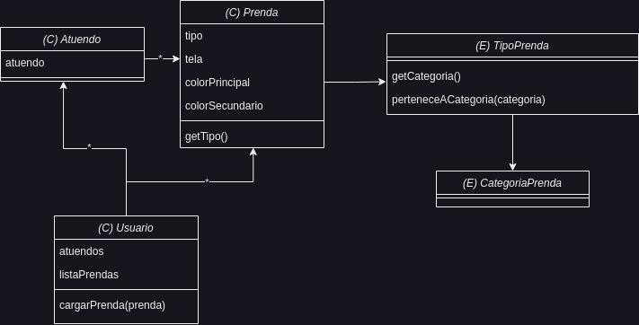

# Ejercicio Qué Me Pongo
## Primera iteración
### Enunciado
[Link del enunciado](https://docs.google.com/document/d/1k1f-9AuIohlBGB2soSNePJ6jLxM37_tZeSD-hW_esIQ/edit?usp=sharing)

### Diagrama de clases

